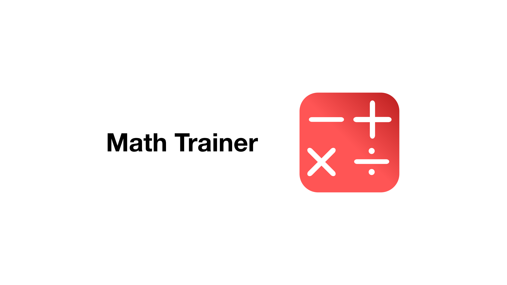
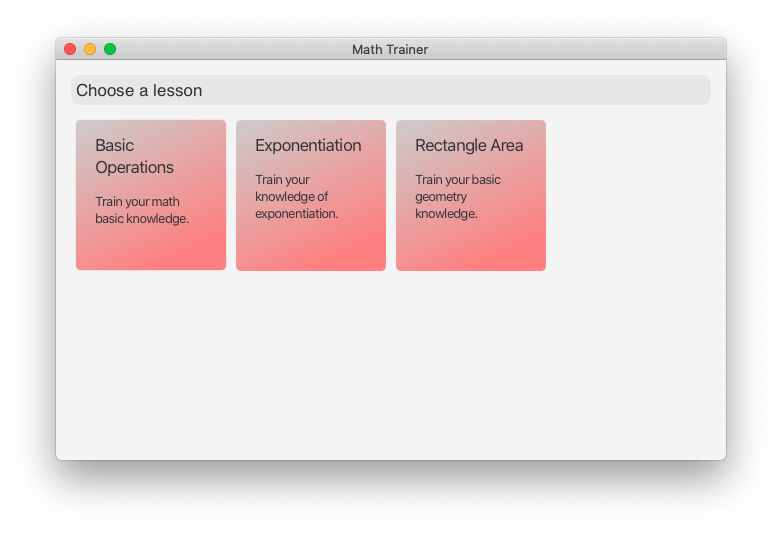
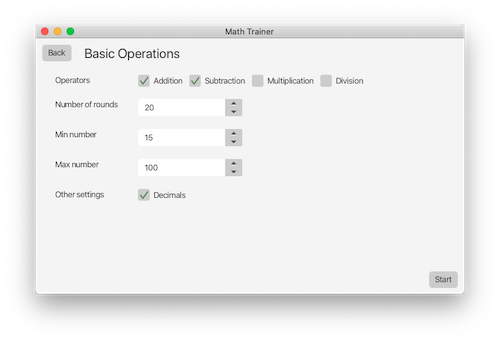
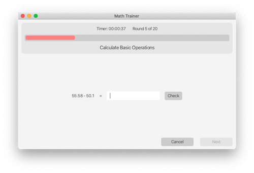

# Math Trainer

  

> Math trainer is a small math training application with currently three available lessons.

## Table of Contents

1. [Learn, receive Awards and have Fun.](https://github.com/GregorGott/Math-Trainer#Learn,-receive-Awards-and-have-Fun.)
2. [Download Math Trainer](https://github.com/GregorGott/Math-Trainer#Download-Math-Trainer)
3. [Available Lessons](https://github.com/GregorGott/Math-Trainer#Available-Lessons)
5. [Image Gallery](https://github.com/GregorGott/Math-Trainer#Image-Gallery)
6. [License & Developer Information](https://github.com/GregorGott/Math-Trainer#license-&-developer-information)

## Learn, receive Awards and have Fun.
The idea of Math Trainer is to bring math nearer to people by using a beautifully designed user interface.
You can also get a streak by doing lessons daily. But the most important thing is, that you have fun.

## Download Math Trainer
A download is currently not available. But it is planned for the 22nd June 2022. It will be available for
Mac, Windows and Linux based operating systems.

## Available Lessons

| Name             | Description                             | Released |
|------------------|-----------------------------------------|----------|
| Basic Operations | Train your math base knowledge.         | ✅        |
| Exponentiation   | Train your knowledge of exponentiation. | ✅        |
| Rectangle Area   | Train your basic geometry knowledge.    | ✅        |

## Image Gallery

  
  
  

## License & Developer Information
### Developer Information
This project uses Modern-Dialog-Windows. Check it out [here](https://github.com/GregorGott/Modern-Dialog-Windows).

### License
GNU General Public License v3.0: https://www.gnu.org/licenses/quick-guide-gplv3.html
